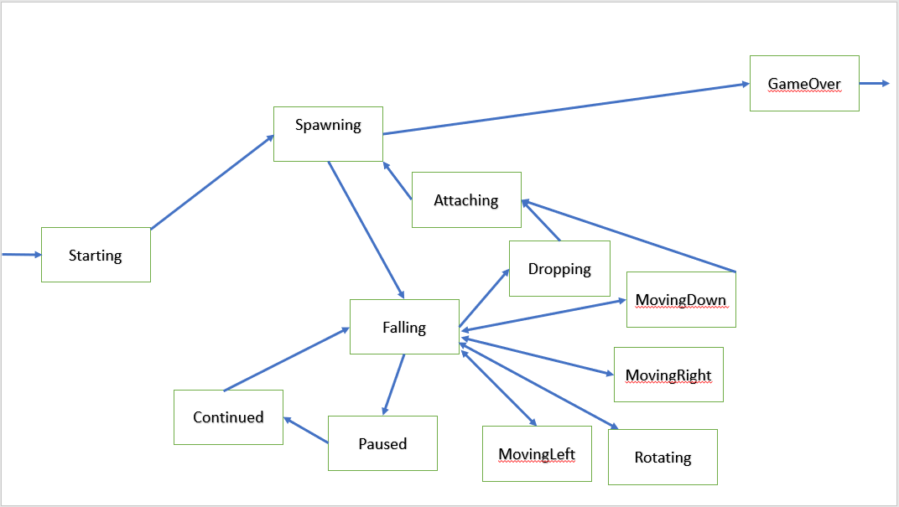

# BrickGame Тетрис

В данном проекте реализована игра «Тетрис» на языке программирования С с использованием структурного подхода в виде библиотеки и cli-gui.

## Установка и удаление пакетов библиотек
```sh
cd src
make install
```
```sh
make uninstall
```

## Компиляция и запуск

```sh
make all
```

## Тестирование

Запуск юнит-тестов с отчётом в терминале о покрытии кода тестами.

```sh
make test
```

## Генерация отчёта тестов в html

Запуск юнит-тестов с генерацией отчёта в html о покрытии кода тестами.

```sh
make gcov_report
```

## Генерация документации в html

Запуск юнит-тестов с генерацией отчёта в html о покрытии кода тестами.

```sh
make dvi
```

## Создание архива с дистрибутивом

Запуск юнит-тестов с генерацией отчёта в html о покрытии кода тестами.

```sh
make dist
```

## Диаграмма состояний конечного автомата


